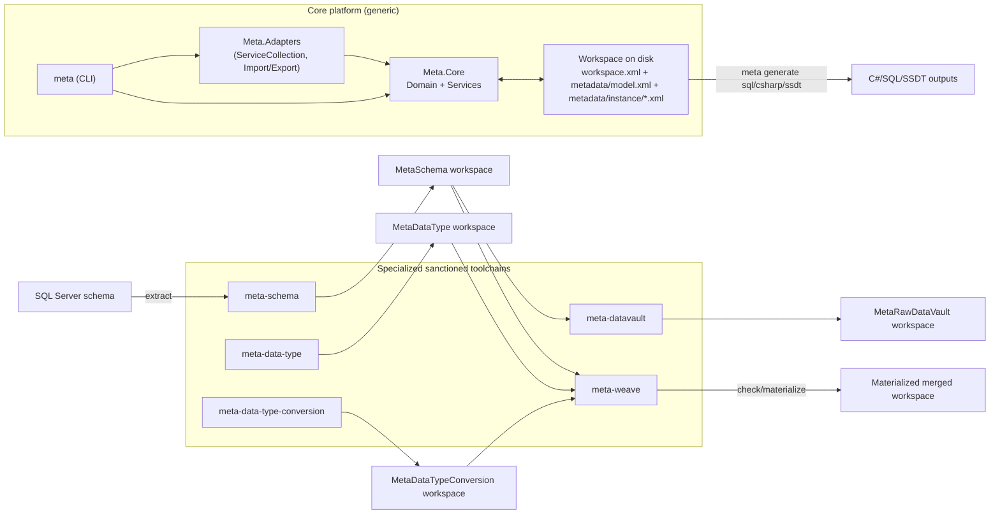

# BI System Architecture

## Purpose

This document defines the intended model stack for the `meta` family beyond the current foundations.

The end goal is not a pile of unrelated sanctioned models. The end goal is that a user-defined BI system model can compose sanctioned models and drive end-to-end build, deployment, and operations for large BI systems.

This document keeps the stack explicit:

- what is foundational
- what is implementation-domain metadata
- what belongs in user system models
- what must stay generic
- what must be modeled in full rather than as a toy subset

Companion inventory document: [Platform.md](Platform.md)

## Useful separation of levels

An architecture matrix is useful here, not as something to copy literally, but as a way to keep levels separate while the BI stack is still being defined.

The useful distinction is:

- `Meta-meta`: the metadata platform itself. In our case, this is the foundation layer (`Meta.Core`, workspace/model/instance semantics, generic CLI/tooling).
- `Meta`: framework definitions and architecture definitions. This is where generic architecture and framework-shaping concepts belong.
- `Model`: business, information, logical, analytical, and implementation-domain models. This is where sanctioned BI models belong.
- `Instance`: concrete technical realizations of those models, such as SQL schemas, pipeline definitions, semantic models, and other product-facing metadata instances.
- `Runtime`: the live platform and automation estate: deployment, execution, monitoring, rollback, infrastructure, and operational health.

Two distinctions are especially important:

- model objects are not the same thing as technical objects
- technical objects are not the same thing as runtime estate

That separation matters because one model may project into several technical surfaces, and one runtime platform may execute many technical artifacts derived from several models.

Framework names and product names in architecture discussions are examples only. They are useful for thinking, but they must not silently become sanctioned assumptions in the model stack. `BIML`, `SSIS`, `SSAS`, `Power BI`, `Azure`, `TOGAF`, `Kimball`, and `Data Vault` should be treated as reference points unless and until a sanctioned model explicitly commits to one of them.

## Current implemented architecture (repo state)

This diagram reflects the currently implemented architecture and flow in this repository.

## Design stance

The project should hit hard where it can be generic.

That means:

- generic metadata core
- generic workspace/model/instance tooling
- generic weaving between sanctioned models
- generic merge/materialize/diff/refactor primitives

It does not mean every sanctioned model should become vague or abstract for its own sake.

Some domains must be modeled with real coverage if they are introduced at all:

- Data Vault: raw and business, including hubs, links, satellites (standard/multi-active/effectivity/record-tracking), reference tables, PIT tables, and bridge tables
- SSDT: `sqlproj` and related SQL project/deployment metadata modeled 1:1
- SSIS: `dtproj` and `dtsx` modeled 1:1, including control-flow/data-flow/runtime details
- SSAS: multidimensional/tabular project surfaces modeled 1:1

The system should avoid half-formed demo models for those domains. If a domain is introduced, it should be introduced as a serious sanctioned boundary with a credible path to full coverage.

## Model stack

All sanctioned models here serve BI outcomes. The useful split is not "domain vs non-domain", but where each model sits in the stack and how tightly it is coupled to external products/specifications.

### Cross-model infrastructure

- `MetaWeave`

Purpose:
- explicit bindings across model boundaries
- RI validation of cross-model references
- deterministic composition/materialization

### BI foundation models (product-neutral)

- `MetaSchema`
- `MetaDataType`
- `MetaDataTypeConversion`
- `MetaTransform`

Purpose:
- source-system structure capture (`MetaSchema`)
- canonical type identity (`MetaDataType`)
- mapping and conversion intent (`MetaDataTypeConversion`)
- transformation intent (`MetaTransform`)

These are BI-domain models, but not tied to a single execution product format.

### BI business-semantic models

- `MetaBusiness`

Purpose:
- own business-semantic meaning that is not the same thing as source structure or product artifacts
- define business concepts, business-facing identities, and business-level modeling intent
- act as the semantic anchor for downstream projections such as business vault, warehouse, and analysis

This is the point where the stack stops being purely source-first. Business meaning should not be smeared across `MetaSchema`, `MetaDataVault`, `MetaDataWarehouse`, or semantic-product models.

Boundary note: [META-BUSINESS-BOUNDARY.md](META-BUSINESS-BOUNDARY.md)

### BI implementation-spec models

- `MetaDataVault`
- `MetaDataWarehouse`
- `MetaOrchestrator`

Purpose:
- model implementation patterns/structures that are specific to BI architecture styles and operating models.

### BI product-coupled models

- `MetaSSDT`
- `MetaSSIS`
- `MetaSSAS`

Purpose:
- represent concrete product artifacts as metadata.

### User-composed system models

- user-defined `BISystemModel`

This is the top layer. It is where a real BI system is composed from business entities, source systems, security, warehouse patterns, orchestration intent, semantic-model intent, and deployment intent.

The sanctioned models are building blocks. The user model is the system design.

## Realization path

The stack needs to be understood as a realization path, not just a list of models.

Broadly:

- sanctioned models hold intent and reusable domain meaning
- user system models compose that intent into one concrete BI system
- tools and commands project model intent into technical metadata instances and artifact surfaces
- technical instances are then deployed and executed as part of a live platform

So the important separation is:

- model intent
- technical metadata instances
- emitted artifacts
- runtime estate

The framework should make those transitions explicit. A model is not an artifact, and an artifact is not a running platform. The toolchain is what realizes one level into the next.

## Current foundation boundaries

### `MetaSchema`

Purpose:

- discover source-system structural metadata
- materialize that metadata into a normal metadata workspace

Current scope:

- systems
- schemas
- tables
- fields
- field `TypeId`

Boundary:

- `MetaSchema` should know only `MetaSchema`
- it should not own `MetaDataType`, `MetaDataTypeConversion`, `MetaTransform`, or `MetaWeave`
- connectors discover facts only
- connectors do not decide canonical type mappings

### `MetaDataType`

Purpose:

- own the sanctioned type vocabulary

Current scope:

- `TypeSystem`
- `Type`
- `TypeSpec`

Boundary:

- type identities live here
- other models reference those identities through scalar `...Id` properties and weave bindings

### `MetaDataTypeConversion`

Purpose:

- declare type mappings and conversion implementation identities

Current scope:

- conversion metadata
- `check`
- `resolve`

Boundary:

- `MetaDataTypeConversion` declares what maps to what
- it does not execute runtime conversions itself
- downstream tools consume `ConversionImplementationId`

### `MetaTransform`

Purpose:

- model transformation intent generically

Expected direction:

- projection
- derivation
- filtering
- joining
- row-shape transformation
- normalization intent

Boundary:

- transform semantics should not be smeared across `MetaSSIS`, `MetaDataVault`, or `MetaDataWarehouse`
- downstream tools may compile `MetaTransform` into high-performance SQL or other runtimes
- `MetaTransform` should hold transform intent, not execution-host specifics

### Feature and state layer

The eventual BI platform will also need metadata that is not just "design intent", but "system state and value-add behavior".

That likely includes concerns such as:

- completeness
- deployment state
- usage
- monitoring
- health
- diagnostics
- rollback and recovery evidence

This should be treated as its own layer of concern rather than quietly mixed into the core design models. The exact sanctioned shape is not decided yet, but the need is real: a generated BI system is not only something to define, it is also something to observe, validate, and operate.

### `MetaWeave`

Purpose:

- define explicit cross-model bindings where scalar properties in one model resolve against identities in another

Current scope:

- sanctioned generic weave model
- sanctioned weave instances
- `check`
- authoring facade commands
- `materialize`

Boundary:

- weave meaning is explicit metadata
- no hidden external-reference magic in the core
- cross-model references remain scalar properties for isomorphism

## User `BISystemModel`

The future user model is not a monolith replacement for the sanctioned models.

It should:

- compose them
- weave them
- add business-specific entities and rules
- drive generators and deployment flows

Typical content of a user `BISystemModel`:

- business entities
- source-system intent and bindings
- security intent
- Data Vault design intent
- warehouse design intent
- transform intent
- orchestration intent
- deployment intent
- semantic-model intent

The sanctioned models are not the final user artifact. They are the stable shared substrate that the user model builds on.

## Domain expectations

### `MetaDataVault`

This model must be full-fidelity enough to be credible in real BI systems.

Required direction:

- raw vault
- business vault
- hubs
- links
- satellites (standard, multi-active, effectivity, record-tracking)
- reference tables
- PIT tables
- bridge tables
- supporting structures needed for real implementations

This should not be introduced as a stripped-down hub/link/sat-only toy unless there is a clear phase plan that explicitly names the missing real structures.

### `MetaDataWarehouse`

Purpose:

- warehouse-serving structures on top of source and/or vault models

Expected direction:

- dimensions
- facts
- conformed structures
- warehouse-specific keys and load intent

### `MetaSSDT`

Purpose:

- SQL project and deployment metadata modeled 1:1 from `sqlproj` and related SQL project assets

Expected direction:

- `sqlproj` project structure
- publish/deploy intent
- not just emitted SQL files

### `MetaSSIS`

Purpose:

- package/pipeline metadata modeled 1:1 from `dtproj` and `dtsx`

Expected direction:

- control flow
- data flow
- sources
- destinations
- transforms
- variables
- parameters
- environment/config details

This should not stop at "a pipeline has a source and target."

### `MetaOrchestrator`

Purpose:

- scheduling and operational flow on top of executable implementation models

Expected direction:

- dependencies
- execution groups
- retries
- scheduling
- environment bindings
- operational control metadata

### `MetaSSAS`

Purpose:

- semantic model/project metadata modeled 1:1 for SSAS surfaces

Expected direction:

- multidimensional
- tabular
- dimensions
- measures
- partitions
- processing intent
- deployment/process metadata

This area is large enough that it may need internal subdivision, but it still belongs under a coherent sanctioned boundary.

## Weaving and composition

The project should not collapse everything into one giant sanctioned model.

Instead:

- sanctioned models stay separate
- scalar ids carry cross-model references
- `MetaWeave` makes those references explicit
- `meta-weave check` proves 100% RI
- `meta-weave materialize` can produce composed workspaces where needed

This keeps:

- isomorphism
- generic tooling
- explicit model ownership

## Traceability requirement

The framework should preserve traceability across levels:

- from model intent
- to technical metadata instances
- to emitted artifacts
- to runtime execution and operational evidence

That means a future BI platform should be able to answer questions such as:

- which model elements produced this artifact?
- which command or tool surface materialized it?
- which sanctioned models and bindings were involved?
- what runtime behavior, failure, or deployment event can be traced back to that metadata?

This is not only data lineage. It is metadata-to-artifact-to-runtime traceability.

## Irregular or non-standard concerns

Not everything in a real BI system will fit cleanly into one sanctioned model on the first pass.

That does not justify a generic dumping ground. The better direction is:

- sanctioned models should expose explicit extension or custom paths where truly needed
- irregular concerns should still be represented explicitly as metadata
- custom material should remain visible and owned, not hidden outside the system

The exact mechanism may differ by model, but the principle should stay the same: if something does not fit, it should fail into a sanctioned path, not into architecture drift.

## What must remain generic

The following should stay in shared or generic layers:

- workspace/model/instance load/save
- validation
- model+instance refactors
- workspace merge/materialization
- weaving evaluation
- deterministic generation surfaces

The following should not leak vendor or domain hacks into core:

- source-specific schema extraction behavior
- SSIS-specific package logic
- SSAS-specific semantics
- Data Vault naming conventions
- warehouse-specific business rules
- runtime conversion implementations
- runtime transform-host specifics

Those belong in sanctioned domain models and their tools, not in `Meta.Core`.

## What must not happen

- no monolith "one model owns everything"
- no vendor-specific hacks in shared core
- no hidden cross-model references outside weave metadata
- no fake simplified domain models presented as production-ready
- no mixing runtime execution code into metadata-only sanctioned models unless that boundary is explicitly intended

## Recommended execution order

The practical order remains:

1. finish and harden the foundation stack
   - `MetaSchema`
   - `MetaDataType`
   - `MetaDataTypeConversion`
   - `MetaTransform`
   - `MetaWeave`
2. define `MetaDataVault`
3. define `MetaDataWarehouse`
4. define `MetaSSDT`
5. define `MetaSSIS`
6. define `MetaOrchestrator`
7. define `MetaSSAS`
8. support user-composed `BISystemModel` on top of the above

## Immediate next-step guidance

If work starts on a new sanctioned domain model, the first question should be:

- what generic substrate is already solved by the foundation stack?

The second should be:

- what full-fidelity feature surface must this domain eventually cover to be credible?

If those two questions are not answered, do not start coding that model yet.
